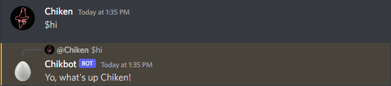
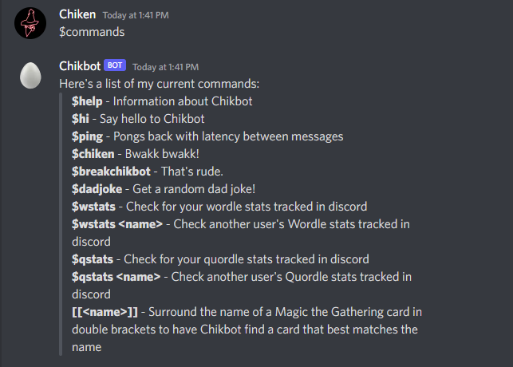
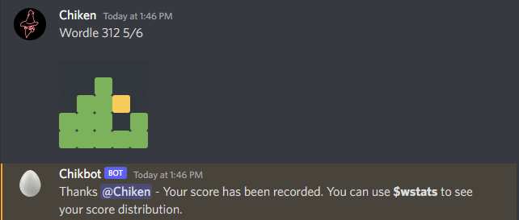
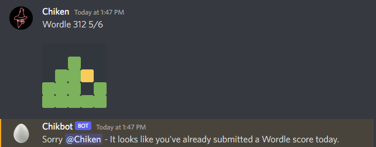
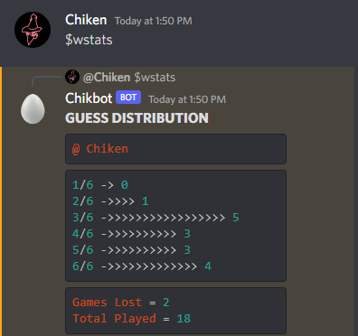
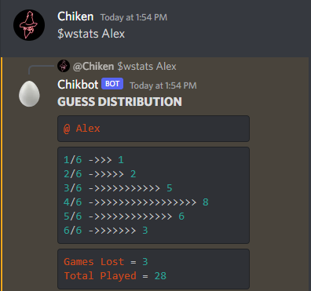
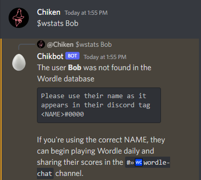

# Chikbot
Chikbot was born as a passion project around the time Wordle became popular. For a while I knew I wanted to build a Discord bot and experiment with what potential it could bring to my Discord server. The initial inspiration was being able to track individual's Wordle scores from day to day as a bit of friendly competition. After getting comfortable with the Node.js module known as Discord.js (https://discord.js.org/#/) I began to implement other functionality as well as work to have it fully hosted on Heroku utilizing a PostgreSQL database for storing my data.

### User Stories

- [x] Implement basic commands/functionality for the bot to be utilized by users in the discord
- [x] Per user Wordle score tracking https://www.nytimes.com/games/wordle/index.html

### Additional User Stories
- [x] Quordle support (Alteration of Wordle, web browser game; https://www.quordle.com/#/ )
- [x] Dad Joke API Implementation https://icanhazdadjoke.com/api
- [x] Magic The Gathering API Implementation https://docs.magicthegathering.io/
  - [x] Search for Magic The Gathering playing cards and display them to the user
- [ ] Create functionality for users to create Tasks/Goals list
- [ ] Implement self-assign user roles through Chikbot

# Getting Started

Initially, when I was learning how to build my discord bot I started with the basics. A few commands, and of course a few of them to mess with my friends while I was getting myself situated.

Here's a basic idea of the commands that Chikbot is currently supporting:

# Wordle Support

The driving idea behind me building Chikbot in the first place was to gather Wordle scores posted by friends in the discord channel. I wanted to be able to track it so we could enjoy some friendly competition.

Here you can see Chikbot checks the chat for any pasted Wordle scores, utilizing regex and some other checks and balances to make sure the score that was posted is how a pasted wordle score should look.

After submitting your score, the database will recognize wether or not you've already submitted for that day. Each day the "played" tracker will reset automatically, allowing you to submit another score.

#### $wstats
Since I've already tracked some Wordle games, I can go ahead and use the $wstats command to check my scores.

#### $wstats \<name\>
I want to see the stats of one of my friends who has also been playing, so this time I use a command with a name flag

If you search for a user incorrectly or search for someone who isn't in the database, it will return instructions on how to find the player you're looking for and also let you know how to begin tracking scores.

