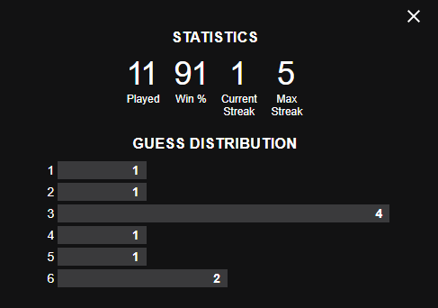
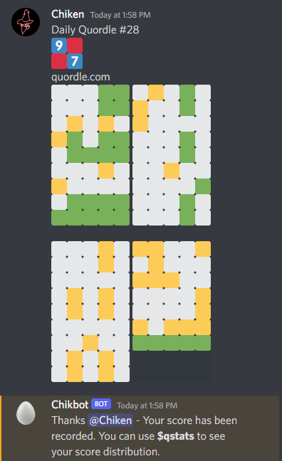
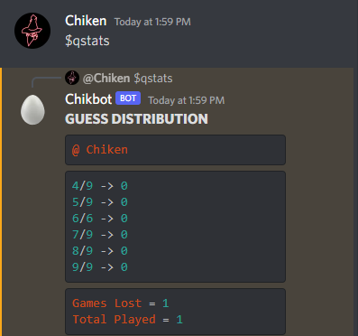
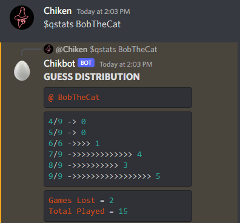
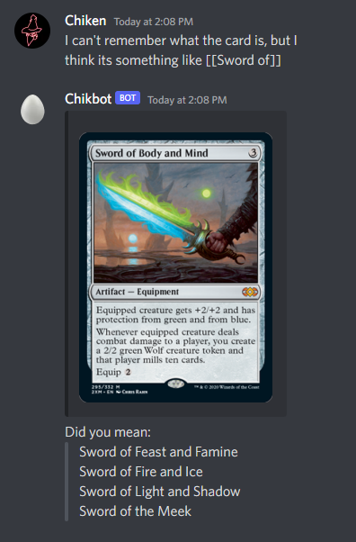
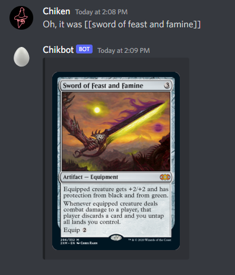
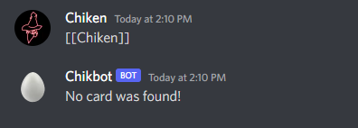
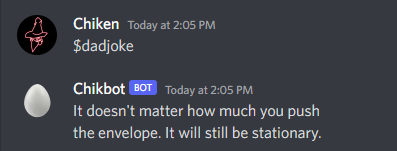
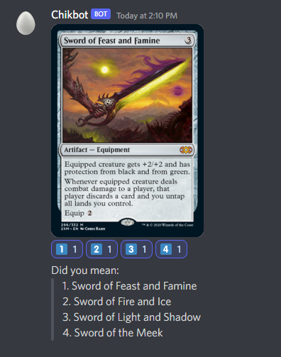

# Chikbot
Chikbot was born as a passion project around the time Wordle became popular. For a while I knew I wanted to build a Discord bot and experiment with what potential it could bring to my Discord server. The initial inspiration was being able to track individual's Wordle scores from day to day as a bit of friendly competition. After getting comfortable with the Node.js module known as Discord.js. I began to implement other functionality as well as work to have it fully hosted on Heroku utilizing a PostgreSQL database for storing my data.

# Table of Contents
* [User Stories](https://github.com/jsgit21/Chikbot/blob/master/README.md#user-stories)
* [Getting Started](https://github.com/jsgit21/Chikbot/blob/master/README.md#getting-started)
  * [List of Commands](https://github.com/jsgit21/Chikbot/blob/master/README.md#commands)
* [Wordle Support](https://github.com/jsgit21/Chikbot/blob/master/README.md#wordle-support)
  * [Official Wordle Scoring](https://github.com/jsgit21/Chikbot/blob/master/README.md#for-reference-here-is-the-graph-that-the-official-wordle-displays-for-you-as-it-tracks-your-score-on-the-website) 
  * [How Chikbot Handles Scoring](https://github.com/jsgit21/Chikbot/blob/master/README.md#now-lets-see-how-it-works-with-chikbot)
* [Quordle Support](https://github.com/jsgit21/Chikbot/blob/master/README.md#extending-to-quordle)
* [Validation and Error checking](https://github.com/jsgit21/Chikbot/blob/master/README.md#-validation-and-error-checking-)
* [Magic The Gathering API](https://github.com/jsgit21/Chikbot/blob/master/README.md#magic-the-gathering-api)
* [Dad Jokes API](https://github.com/jsgit21/Chikbot/blob/master/README.md#dad-jokes)
* [The Future of Chikbot](https://github.com/jsgit21/Chikbot/blob/master/README.md#the-future-of-chikbot)
  * [Magic The Gathering API](https://github.com/jsgit21/Chikbot/blob/master/README.md#magic-the-gathering-api-1)
  * [List of Goals](https://github.com/jsgit21/Chikbot/blob/master/README.md#creating-a-list-of-goals)
* [References](https://github.com/jsgit21/Chikbot/blob/master/README.md#references) 

### User Stories
[Back to the top](https://github.com/jsgit21/Chikbot/blob/master/README.md#chikbot)

- [x] Implement basic commands/functionality for the bot to be utilized by users in the discord
- [x] Per user Wordle score tracking

- [x] Quordle support (Alteration of Wordle, web browser game)
- [x] Magic The Gathering API Implementation
  - [x] Search for Magic The Gathering playing cards and display them to the user
- [x] Dad Joke API Implementation
- [ ] Create functionality for users to create Tasks/Goals list
- [ ] Implement self-assign user roles through Chikbot

# Getting Started
[Back to the top](https://github.com/jsgit21/Chikbot/blob/master/README.md#chikbot)

Initially, when I was learning how to build my discord bot I started with the basics. A few commands, and of course a few of them to mess with my friends while I was getting myself situated.

#### $commands

Here's a basic idea of the commands that Chikbot is currently supporting:

# Wordle Support
[Back to the top](https://github.com/jsgit21/Chikbot/blob/master/README.md#chikbot)
The driving idea behind me building Chikbot in the first place was to gather Wordle scores posted by friends in the discord channel. I wanted to be able to track it so we could enjoy some friendly competition. If you're not familiar with sharing Wordle scores, Wordle provides a 1-click button that copies the "Wordle score" to your clipboard so you can share with friends. It's only descriptive enough to see the score, but doesn't spoil what the daily word is. I figured, we're already going to share our scores, why not have an in-house tracking system so you can quickly check your progress?

#### For reference, here is the graph that the Official Wordle displays for you as it tracks your score on the website:

The meaning of the above guess distribution; 
* **1/6: 1**   *one game solved in 1 guess*
* **2/6: 1**   *one game solved in 2 guesses*
* **3/6: 4**   *four games solved in 3 guesses*
* **4/6: 1**   *one game solved in 4 guesses*
* **5/6: 1**   *one game solved in 5 guesses*
* **6/6: 2**   *two games solved in 6 guesses*

#### Now, lets see how it works with Chikbot

Here you can see Chikbot checks the chat for any pasted Wordle scores, utilizing regex and some other checks and balances to make sure the score that was posted is how a pasted wordle score should look.

After submitting your score, the database will recognize whether or not you've already submitted for that day. Each day the "played" tracker will reset automatically, allowing you to submit another score.

#### $wstats
Since I've already tracked some Wordle games, I can go ahead and use the $wstats command to check my scores.

#### $wstats \<name\>
I want to see the stats of one of my friends who has also been playing, so this time I use a command with a name flag

If you search for a user incorrectly or search for someone who isn't in the database, it will return instructions on how to find the player you're looking for and also let you know how to begin tracking scores.

# Extending to Quordle
[Back to the top](https://github.com/jsgit21/Chikbot/blob/master/README.md#chikbot)

Quordle... was something that was brought to my attention, essentially being an extension of Wordle. Many of you know that after Wordle, many Wordle-inspired games started spreading like wildfire. Essentially Quordle is where you try to solve four different Wordle games at the same time. There just so happens to now be an Octordle and Sedecordle... which, Chikbot told me he doesn't wan't to deal with parsing those!

Here you can see similar to Wordle, Chikbot is keeping an eye out for any official Quordle scores that are posted. This also utilizes regex and other checks to make sure it is in the official format.

#### $qstats
After submitting a Quordle at least once, you can check your stats. Unfortunately the only Quordle I've submitted was me not succeeding at completeing it, as you can tell by my pasted score. Which is why you don't see any change in my distribution but it has 1 game loss listed.

#### $qstats \<name\>
Thankfully BobTheCat is much better at quordle than myself, as you can tell by their scores. Also similar to Wordle, you will recieve the same message if you search for someone who does not exist in the Quordle database.

# ❗ Validation and Error checking ❗
[Back to the top](https://github.com/jsgit21/Chikbot/blob/master/README.md#chikbot)

Luckily I have a great group of friends that wanted to see just how quickly they could break my bot as I was rolling the wordle functionality out, and I'll admit they were pretty creative!

* Names that are too long to be discord names instantly fail when searching for other user stats.

* The bot is protected from breaking when attempting to pass in random vegetable emojis, or any emojis for that matter.

* The bot will not except your game scores if they are not in the expected format provided from the official game.

Another thing to consider is parsing these scores in discord and tracking the data is simply for fun. While I do validate the data that is being parsed and also limit it to one submission per day (just like the daily Wordle/Quordle), there's no way to check if the pasted score is the official score. Meaning, someone can mimick the score to make it look like they are doing really well and submit it. For the scope of Chikbot, and the fact that it is within a community discord, it's reliant on honest people just wanting to have some fun when sharing with friends.

# Magic The Gathering API
[Back to the top](https://github.com/jsgit21/Chikbot/blob/master/README.md#chikbot)

Magic The Gathering is a strategy card game that I enjoy playing with friends from time to time. Although there are already bots out there that do this kind of thing very well, I wanted to have my own home grown solution to sharing/talking about cards among friends. So I utilized an neat API to help me search for cards and display them.

#### \[\[\<name\>\]\]
You can search for any card by wrapping the name you want to search in double brackets. You can even include that in the middle of any text, as my implementation of regex only cares about whatever is inside the opening and closing double brackets. As you can see I provided a name that was not found as a full match - When this is the case, Chikbot will provide back the best match, and also list posibilities of other cards (up to 5) below the shown card.

If you search for a card and there is an exact match or only one match, there will be no other posibilities listed below

Of course, if you search for a card that doesn't exist, Chikbot will let you know.

# Dad Jokes
[Back to the top](https://github.com/jsgit21/Chikbot/blob/master/README.md#chikbot)

There's not much to say when it comes to a good dad joke, One of my friends mentioned it and I thought it would be fun so I found an API for it and did a quick implementation in the early stages of Chikbot!

# The Future of Chikbot
[Back to the top](https://github.com/jsgit21/Chikbot/blob/master/README.md#chikbot)

I am first focusing on tweaking my code to ensure that is manageable and scalable before I add many more features. This is not only a passion project, but a way for me to learn and explore. Here are some things I'd like to implement as I continue to grow Chikbot in my spare time. 

### Magic The Gathering API
When searching for a card and "Did you mean" options are displayed, I would like to have Chikbot number those cards 1-5. Underneath the Image of the card displayed, there will be reactions of numbers 1-5. This way, if the user meant the card that is listed as 2. they can just react with "2" and Chikbot will search/display the card for them without having to retype it out. It would look something like this:

This will require exploring Discord.js more to find out what would be my best option, whether it's reactions or support for physical buttons.

### Creating a List of Goals
My discord houses a lot of people who are primarily gamers at heart. It was suggested to have a channel where people can post a list of their goals, and then go back and check/cross them off once they've been achieved. I thought that this idea could be a really fun implementation for Chikbot to support. Some commands that might come with a feature like this:

* $goals add <description> - add a goal to your list
* $goals - show your current goals
* $goals <name> - show the current goals of a user
* $goals complete <goal number> - mark a goal as completed
* $goals delete <goal number> - remove a goal from your list

# References
Discord.js https://discord.js.org/#/

Wordle https://www.nytimes.com/games/wordle/index.html

Quordle https://www.quordle.com/#/

Magic The Gathering API https://docs.magicthegathering.io/

Dad Joke API https://icanhazdadjoke.com/api
